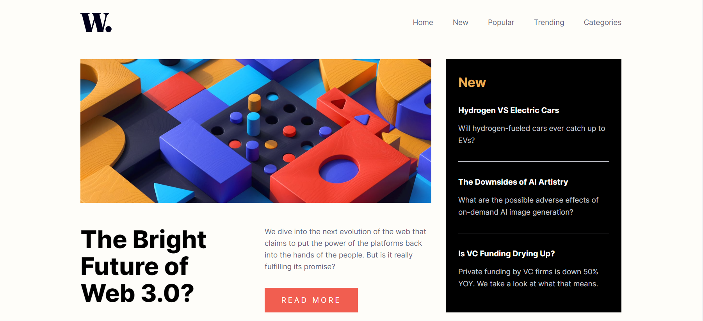
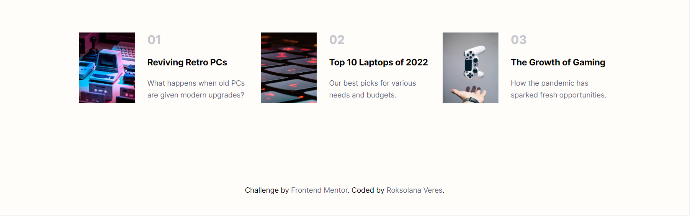

# Frontend Mentor - News homepage solution

This is a solution to the [News homepage challenge on Frontend Mentor](https://www.frontendmentor.io/challenges/news-homepage-H6SWTa1MFl). Frontend Mentor challenges help you improve your coding skills by building realistic projects.

## Table of contents

- [Overview](#overview)
  - [The challenge](#the-challenge)
  - [Screenshot](#screenshot)
  - [Links](#links)
- [My process](#my-process)
  - [Built with](#built-with)
  - [What I learned](#what-i-learned)
  - [Useful resources](#useful-resources)

## Overview

### The challenge

Users should be able to:

- View the optimal layout for the interface depending on their device's screen size
- See hover and focus states for all interactive elements on the page

### Screenshot

### Links

- Frontend Mentor solution url: 
- GitHub repo : 
- Live Site URL: 

## My process

### Built with

- Semantic HTML5 markup
- BEM naming approach
- Flexbox
- CSS Grid
- Mobile-first workflow

### What I learned

- Refreshed my knowledge about grids
- Tried to use mobile-first approach
- Expanded knowledge of BEM naming strategy
- Struggled with the dropdown menu, but finally managed to do it

### Useful resources

- [Responsive navbar](https://www.youtube.com/watch?v=GdrbE-s5DgQ&ab_channel=WebDevCreative) - great tutorial on how to create responsive navbar and dropdown menu.
